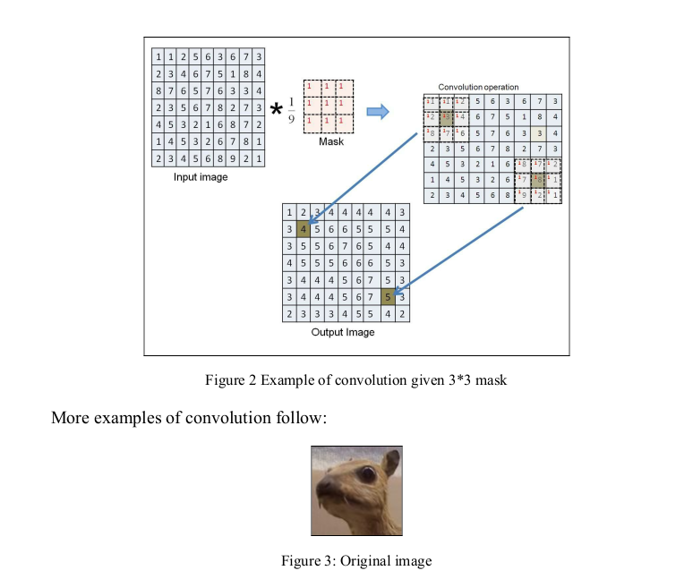
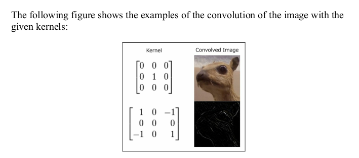
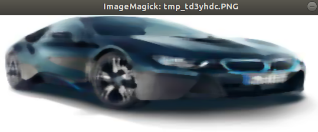
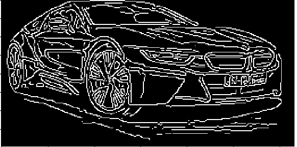

## Computer Vision

Computer vision can be applied in social platforms, medicine, autonomous driving, security and many other fields

### Python Modules

Pillow (PIl): Python imaging Library. 
``` pip install pillow```

Cropping: means extract a particular region of the image, which is smaller than original image. The region extracted by the crop operation is called ROI: Region Of Interest. A ROI can be extremelly useful when we want to apply our algorithm in a specific section of the image. 


```
from PIL import Image

# Load original picture
img = Image.open("media/palermo.jpg")
img.show()

# Print format and size of the original picture
print(img.format)
print(img.size)

# Set dimension of the ROI
dim = (0, 0,50,50)
# Extract ROI
crop_img = img.crop(dim)
crop_img.save("media/crop.jpg")
crop_img.show()
```

## Changing color 

There are different color spaces:
* Grayscale: Each pixel has a value between 0 and 255. 0 is black and 255 is white. 
* Red green Blue (RGB): each pixel is a combinatyion of three values, each rapresenting a color in rd, green and black (255, 255, 255) for example.
* Hue, Saturation, Value (HSV): Cylindrical coordinate system where we project RGB values onto a cylinder. The HSV scale allows us to change the shades by carying values and saturations. 

Image depth or color depth: number of bits used to represent a color of a pixel. 
```
from PIL import Image

# Load image that we want to convert
img = Image.open("media/palermo.jpg")
# Convert image in greyscale
gray_image = img.convert("L")
# Show image in greyscale
gray_image.show()
```

### Geometrical transformation

```
from PIL import Image

img = Image.open("media/palermo.jpg")
# Resize the image
resized_img = img.resize((100,100))
resized_img.show()
# Rotate imaage
rotated_img = resized_img.rotate(90)
rotated_img.show()
```

### Image enhancement

```
# Change the Brightness of an image
from PIL import Image, ImageEnhance
# Get original image to modify
im = Image.open("media/bwm.jpeg")

enhancer = ImageEnhance.Brightness(im)
# enhancer.enhance(x) -> x: Brightness level
enhanced_im = enhancer.enhance(10)
# Save new updated image
enhanced_im.save("enhanced.bmw.png")
enhanced_im.show()
```

With ImageEnhance we can also modify the contrast of the image. 

### Access / Modify pixels

```
import PixelAccess
```
PixelAccess is a python class mostly used for its two main methods:
* getpixel(): return the color value of the pixel at the (x,y) coordinates. ```print(img.getpixel(100,100))```
* putpixel(): changes the ciolor value of the pixel at the x, y, using the RGB colors. ``` img.putpixel((100,100),(20.230.145))`` -> This means, assign the color created by the conbination of 20red, 230 Green and 145 blue in the pixel present at the position of cordinates X=100 and Y=100

## Scikit-image

This library works with image with float pixels (where every pixel has a value between 0 and 1).
```pip install scikit-image```

In Scikit-image, an image can be read using the imread() function, that returns a N Dimensional array. 


#### Numpy

General-purpse array-processing package, with high performance with multiple arrays (remember, an image is a 2D: array).

Numpy can be used to integrate also C/c++ and Fortran code.

#### Matplotilib

Python library that allows to manipulate an image, modifying it's properties, style, zoom in and zoom out. 

#### CV2
OpenCV-Python is a library designed to solve computer vision problems.

### CV:  Show an image

```
import numpy as np

import cv2 as cv

# Load an image , the 0 paramenteer will convert the img in black and white
img = cv.imread('../media/palermo.jpg')

# Show the image in a window where: 
# 1rst parameter is the window title and the 2nd is the image to show

cv.imshow('image', img)
 ```
Fetch an image:
```
# Fetch the image and show it gray scale
cv2.imread('mypic.png', 0)
# OR
cv2.imread_grayscale('mypic.pnj')  
```
```
# Fetch the image and show it with it's origina colors
cv2.imread('mypic.png', 1)
# OR
cv2.imread_color('mypic.png')
```

# Image derivatives

An image derivative is defined as the change in the pixel value of an image.
Given an image matrix, we can find the derivative using another matrix called mask or kernel. 

## Kernel in Image processing

What is a kernel matrix?
A Kernel, convolution matrix or mask is a small matrix. It is used for edge dection and sharpening of an image, by doing a convoluton between a kernel and image.
Convolution is the process of adding each element of the image to its local neighbors, weighted by the kernel. This is related to a form of mathematical convolution. The matrix operation being performed—convolution—is not traditional matrix multiplication, despite being similarly denoted by "*".

For example, if we have two three-by-three matrices, the first a kernel, and the second an image piece, convolution is the process of flipping both the rows and columns of the kernel and multiplying locally similar entries and summing. The element at coordinates [2, 2] (that is, the central element) of the resulting image would be a weighted combination of all the entries of the image matrix, with weights given by the kernel:

Convulation is defined as the sum of the product of the corresponding elements of a kernel matri to an image matrix. 
Let's try to understand what this means. 
Given a kernel, multiply the curresponsing elements of the image matrix and kernel matrix, and sum the multiplied values centered around a particular pixel in the image. In a new empty (black) image, set
the corresponding pixel from the original image to the sum of multiplied values.
Now, perform this operation for all the pixels in the original image. This is image
convolution!






## Image filters

Enhance an image, as we have seen in the [enhance brigthness example](source/with-with-pillow/brightness_enhancement.py), is done by applying a function on the pixel value and this operation is called **filtering**.

The most used and popular filters are:
* Gaussian Blur
```
# Guassian Blur Application with Pillow
from PIL import Image
from PIL import ImageFilter

# Fetch original image
img = Image.open('../../media/bwm.jpeg')
# Show original image
img.show()
# Apply the Guassian Blur filter to the image
filterd_image = img.filter(ImageFilter.GaussianBlur)
# Show filtered image
filterd_image.show()
```

```
# Guassian filter wit skimage
from skimage import io 
from skimage import filters

img = io.imread('../../media/bwm.jpeg')
filtered_image = filters.gaussian(img, sigma =0.5)
io.imshow(filtered_image)
io.show()
```

* Median Filter
Median Filter is a non-linear digital filtering techinique used to remove noise from an image or signal. This noise reduction is usually a pre-processing step to improve the result of later processing (for example, edge detection of an image).

Image noise: random variation of brightness or color information in imaqes, and is usually an aspect of electronicnoise. 
```
from PIL import Image
from PIL import ImageFilter

original_image = Image.open('../../media/bwm.jpeg')
filtered_image = original_image.filter(ImageFilter.MedianFilter(7))
filtered_image.show()
```

* Dilation and erosion

Morphological operations:operations that use the inherent structure of features of an image and process the image while maintaining the overall structure. The most common example are pmorphological operations are dilationa nd erosion. 

**Erosion**: remove the top layer of the image.Skiimage provides the ```binary_erosion()``` function. 
**Dilation**: is the opposite of erosion.  It is useful in situation where you you need to fill up unwanted gaps in the image. Skiimage provides the ```binary_dilation()``` function. 

* Customs filters
Both Skiimage and pillow provide the optin of applying custom filterws on images. 
In Pillow, the kernel function takes the size, the sequence of kernel weighs, scale and offset of the image as parametres, where size is the size of the matrix, scale isthe vaue by which the result of the pixel is divided and offset is the value that is added to result after scaling. 

* Image threesholding

## Edge detection - foundamentals concepts

Edge in an image: are significant local changes in the image intensity, usually associated with a discontinuity in either the image intensity or the first derivate of the image itnensity. Edge detection is frequently the first step in recovering information from images. #

Edge point: is a point in an image with coordinates[i,j] at the local fo a significant locan intensity change in the image. 

Edge decector: algorithm that produces a set of edges from an image.

Countour: list of edges or the mathematrical curve that models the list of edges.

Edge linking: process of forming anordered list of edges from an unordered list. By default, edges are ordered by traversal in a clockwise direction. 

## Edge detection with scikit-image - sobel

Sobel uses

```
from skimage import io 
from skimage import filters
from skimage import color

image_to_analize = io.imread('../media/bwm.jpeg')
# Convert picture from RBG to gray channel
image_to_analize = color.rgb2gray(image_to_analize)
edge_of_the_image = filters.sobel(image_to_analize)
io.imshow(edge_of_the_image)
io.show()
```
![tutorial_media/edge_detection.png]

## Canny edge detector

The cannyt edge detector is anoher very important algorithm.
It uses as Sobel edge detector the concept of gradients

Canny edge decector uses has four steps:
1. Smoothing: reduce noise in the image applying th Guassian Filter
2. Find the gradient: find the
gradient magnitude and direction by calculating the x-derivative and y-
derivative. The direction is important, as the gradient is always perpendicular to
the edge.
3. Nonmaximal suppression: In this step, we check whether the gradient
calculated is the maximum among the neighboring points lying in the positive
and negative direction of the gradient; that is, whether it is the local maxima in
the direction of the gradient. If it is not the local maxima, then that point is not
part of an edge.
4. Threesolding: in Canny we use hih and low threshold value. This is called hysteresis thresholding. Let's understand how this works.
We select all the edge points, which are above the high threshold and then we
see if there are neighbors of these points which are below the high threshold but
above the low threshold; then these neighbors will also be part of that edge. But
if all the points of an edge are below the high threshold, then these points will
not be selected.

```
from skimage import io 
from skimage import feature
from skimage import color

image_to_analize = io.imread('../../media/bwm.jpeg')

gray_image = color.rgb2gray(image_to_analize)
edge_detection = feature.canny(gray_image)
io.imshow(edge_detection)
io.show()
```


## Object Detection

Image gradiants and edges give us a lot of information about the shapes of different objects in the image. Using edges, wemight also be able to determine the orientation of the objects in the image most of the times. 

First of all, when working with images we need to their descriptive features.
A good feature should be inviariant to changes in scale, rotation and translations. 

Advanced and important feature descriptiors are corners, Local Binary Pattern(LBP), BRISK and Oriented Fast and Rotated BRIEF. 

## Harris Corner detection

A method to detect cornes in an image to first find all the edges in the image and then pairwise check if the edges if the edges intersect.  This is very inefficient and somotimes impossible to apply. 

Withteh Harris corner detector, we slide a window over an image to calculate the variation in intensity because cornes will have large variations in the intensity around them.

```
from matplotlib import pyplot as plot
from skimage import io 
from skimage.color import rgb2gray
from skimage.feature import corner_harris , corner_subpix, corner_peaks
```
corner_hassis: function where each pixel in the image calculates a mesure of how probable is that the pixel is a corner pixel. 
conver_peaks: use the output of the corner_harris to find the actual cornrs points in the image using measure provided by the canrner_harris function.  It returns the crner pixel coordinated, sued to be plot on the image. 

corner_subpix: it differentiate if the poin is the intersection of two edges or it is really a corner.

```
# Get corners of an image 
from matplotlib import pyplot as plot
from skimage import io 
from skimage.color import rgb2gray
from skimage.feature import corner_harris , corner_subpix, corner_peaks

# Read the Image
image = io.imread('../media/bwm.jpeg')
image = rgb2gray(image)

# COmpute the Harris Cornes in the image
# It returns a corner measure response
corners = corner_harris(image)

# Caulcatute the actualt corners in the image
coords = corner_peaks(corners, min_distance=5)

# Decided if the corner point is an edge point or an isolated peak
coord_subpix = corner_subpix(image, coords)

fig, ax = plot.subplots()
ax.imshow(image, interpolation='nearest', cmap=plot.cm.gray)
ax.plot(coords[:, 1], coords[:, 0], '.b', markersize=3)
ax.plot(coord_subpix[:, 1], coord_subpix[:, 0], '+r')
ax.axis((0, 350, 350, 0))
plot.show()
```


## Local Binary Patterns

In LBP, an eigth-bit binary feature vector is created for each pixel in the image by considering the height neighbouring pixels. 

## Oriented FAST and Rotated BRIEF (ORB)

Oriented FAST and Rotated BRIEF was dveloped at OpenCV. 
ORB performs as well as SIFT on the task of feature detection (and is between and SURF).

## Image stitching

Is at the base of the capturing panorama function present in many smartphones. 
Paronarama images are based on the conceptf of image sticthing.

To stichtwo images toghether, the first thing is to find common points between the images. Once we have the matching points, we alignt them on op of each other.

### Segmentation

Segment an image: process that breaks down an image into smaller regions that individually hold meaningful information and help us understand the overallcontent of the image. 

All the segmentations algorithms interally use clustering of pixels based on their color values. The only difference between these algorithm that used for clustering.  


## Color detection

COlor detection is the easiest form of segmentation. 
A contour detection algorithm will try to group edges togehter will result in a closed loop.

